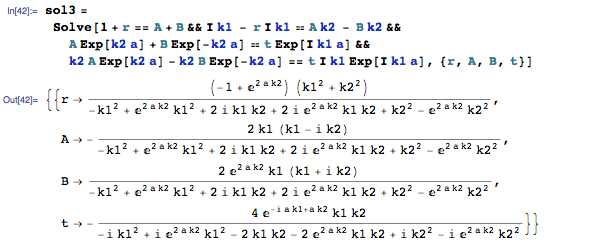

Transmission coefficient

$$ T = \frac{j_t}{j_i} $$

For this square potential, we have

1. $$$0<x<a$$$, 

$$ H = -\frac{\hbar^2}{2m} \frac{d^2}{dx^2} + V_0 $$

Solution should be

$$ \psi_2(x) = A e^{k_2 x} + B e^{-k_2 x} $$

2. $$$ x<0, x>a $$$

$$H = -\frac{\hbar^2}{2m} \frac{d^2}{dx^2}$$

Solutions should be

$$ \psi_1(x) = e^{i k_1 x} + r e^{-i k_1 x} $$

$$ \psi_3(x) = t e^{i k_1 x} $$

Boundary conditions are 

$$\psi_1(0)=\psi_2(0), \psi_1'(0)=\psi_2'(0),\psi_2(a)=\psi_3(a),\psi_2'(a)=\psi_2'(a)$$

Put the waves functions in, we get

$$1+r = A + B, i k_1 - r i k_1 = A k_2 - B k_2$$

$$ A e^{k_2 a} + B e^{-k_2 a} = t e^{i k_1 a}, k_2 A e^{k_2 a} - k_2 B e^{k_2 a} = t i k_1 e^{i k_1 a} $$

Use Solve function in Mathematica,

So we can find $$$|t|^2$$$.

$$T = |t|^2 = \frac{4 k_1^2 k_2^2}{(k_1^2 - k_2^2)^2 \sinh^2(k_2 a) + 4 k_1^2 k_2^2 \cosh^2(k_2 a)}$$

We know

$$\cosh^2(k_2 a) - \sinh^2(k_2 a) = 1$$

So 

$$ T =  \frac{4 k_1^2 k_2^2}{1 + (k_1^2 + k_2^2)^2 \sinh^2(k_2 a) } $$

**Take limits**

At $$$V_0\rightarrow \infty$$$, we have $$$ k_2 \rightarrow 0$$$

$$T \rightarrow 0$$

This is the right case because infinity square potential allows no transmission.

At $$$ E \ll V_0 $$$, we have $$$k_2 \rightarrow 0 $$$

$$ T \rightarrow 0 $$

This is also right because energy is so small to transmit through the square potential. 